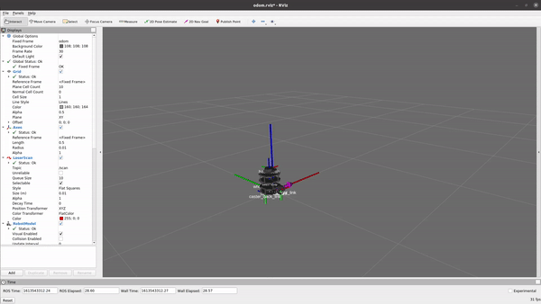
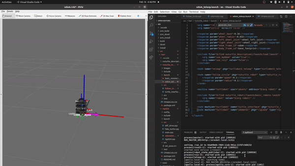

# nuturtle_robot
* A package that provides an interface for hardware on the Turtlebot. Converts body twists to wheel commands and calculates joint states using encoders.
* Author: Arun Kumar

## Example Usage
```
roslaunch nuturtle_robot odom_teleop.launch
```
## Experiment 1
* Drive robot forward and barckward in straight line (pure translation)
* Stop at initial configuration
* Record odometry:
    * x = 0.0302
    * y = 0.0165
    * θ = 0.000600 rad


Note: Gif only shows portion of experiment

## Experiment 2
* Rotate robot in place clockwise and counter clockwise (pure rotation)
* Stop at initial configuration
* Record odometry:
    * x = 0.0000445
    * y = -0.0000181
    * θ = 0.180 rad


Note: Gif only shows portion of experiment

## Experiment 3
* Drive robot in circle clockwise and counter clockwise (translation plus rotation)
* Stop at initial configuration
* Record odometry:
    * x = -0.0290
    * y = 0.0633
    * θ = 0.398 rad
<insert gif>

## Experiment 4
* Drive robot in circle clockwise and counter clockwise (translation plus rotation)
* Goal: produce significantly worse results that experiment 3
    * Increased robot speed
    * Increased circle radius
* Stop at initial configuration
* Record odometry:
    * x = -0.282
    * y = 0.205
    * θ = 1.74 rad
<insert gif>