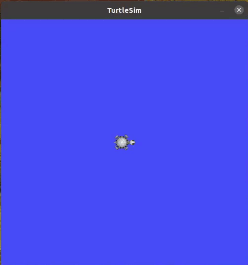

# Turtle Rect
* A Package that commands turtles in turtlesim to draw rectangles at user defined locations with user defined dimensions.

# Example Usage
```
roslaunch trect trect.launch
rosservice call /start "x: 2.0                               
y: 3.0
width: 4.0
height: 5.0" 
```
